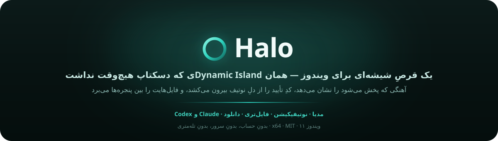

**یک قرصِ شیشه‌ای برای ویندوز؛ همان Dynamic Islandی که همیشه جایش روی دسکتاپ خالی بود.**

 

 

[English](README.md) · **فارسی**

[⬇️ دانلود](https://github.com/phoseinq/Halo/releases/latest) · [گزارش باگ](https://github.com/phoseinq/Halo/issues) · [پیشنهاد قابلیت](https://github.com/phoseinq/Halo/issues)

 

  

### 👈 [قبل از نصب امتحانش کن](https://pvboy.dev/assets/blog/halo-live.html)

بدون نصب، مستقیم داخل مرورگر. روی قرص موس ببر، پنل رو باز کن، نوار زمان رو جابه‌جا کن یا بین اپ‌ها سوییچ کن تا ببینی حس کار کردن باهاش چطوریه.

 

یه قرص شیشه‌ای بالای صفحه که هر وقت چیزی برای نمایش داشته باشه ظاهر میشه و وقتی کاری نداره دوباره
جمع میشه. نه پنجره اضافه، نه شلوغی روی دسکتاپ؛ فقط اطلاعاتی که همون لحظه لازم داری.

 

<h2 align="center">⬇️ دانلود</h2>

### [⬇️ دانلود برای Windows 11](https://github.com/phoseinq/Halo/releases/latest)

Windows 11 · x64 · نصب فقط برای همین کاربر · بدون درخواست دسترسی Administrator

اگر نصب معمولی می‌خوای، `DynamicWinSetup.exe` رو دانلود کن. اگر هم نسخه قابل‌حمل ترجیح میدی، `DynamicWinPortable.zip` آماده است.

 

<h2 align="center">🎵 مدیا</h2>

وقتی چیزی در حال پخشه، قرص زنده میشه.

در حالت بسته فقط Waveform خروجی واقعی سیستم رو می‌بینی؛ اما با باز شدنش، کنترل کامل مدیا در اختیارت
قرار می‌گیره؛ کاور، اسم آهنگ، نوار زمان، کنترل صدا، دکمه‌های پخش و برای ویدیو هم جلو و عقب بردن،
تغییر سرعت و زیرنویس.

همه اطلاعات مستقیماً از Media Session خود ویندوز گرفته میشه؛ بنابراین با بیشتر برنامه‌هایی که ازش
پشتیبانی می‌کنن کار می‌کنه.

 

<h2 align="center">🔔 اعلان‌ها</h2>

اعلان‌ها مستقیم داخل Halo نمایش داده میشن.

آیکون واقعی برنامه، متن اعلان و همه چیز داخل خود قرص دیده میشه و بنر ویندوز هم بی‌صدا میشه تا یک
اعلان دوبار جلوی چشمت ظاهر نشه.

اگر اعلان شامل کد تأیید باشه، فقط روی دکمه **Copy** کلیک کن تا همون لحظه داخل کلیپ‌بورد کپی بشه.

 

<h2 align="center">📁 File Tray</h2>

فایل‌ها رو موقت کنار دستت نگه دار.

کافیه فایل رو روی Halo بندازی؛ هر وقت خواستی دوباره از همونجا بکش و داخل هر برنامه یا هر پنجره‌ای
رهاش کن. انگار یه فضای Drag & Drop همیشه دم دستت داری.

 

<h2 align="center">🤖 پنل‌های هوش مصنوعی</h2>

برای هر سشن Claude Code یا Codex یک پنل زنده ساخته میشه.

می‌بینی الان روی چه کاری مشغوله، چقدر Context باقی مونده، محدودیت‌های زمانی چقدره و اگر خواستی همون
لحظه اجرای پرامپت رو متوقف می‌کنی.

نمودار شبکه فقط سرعت اینترنتت رو نشون نمیده؛ مسیر ارتباط با سرورهای Anthropic رو هم بررسی می‌کنه تا
راحت‌تر بفهمی مشکل از اینترنت خودته یا از سمت سرویس.

روی اطلاعات شبکه هم که موس ببری، جزئیاتی مثل کشور، ASN، تأخیر، Packet Loss و حتی تست واقعی DNS Leak
نمایش داده میشه.

اگر ابزار جدیدی اضافه بشه، فقط با یک فایل JSON می‌تونه پنل مخصوص خودش رو داشته باشه.

 

<h2 align="center">✨ امکانات دیگه</h2>

- ⬇️ **دانلودها** — نمایش پیشرفت واقعی دانلودهای Chrome و Edge، همراه با دکمه Cancel که واقعاً دانلود رو متوقف می‌کنه.
- 🔋 **باتری دستگاه‌های بلوتوث** — درصد باتری هدفون، دسته بازی یا گوشی متصل رو مستقیم داخل Halo ببین.
- ⚠️ **هشدارهای هوشمند** — باتری، CPU، رم یا اینترنت فقط وقتی لازم باشه بهت اطلاع داده میشه؛ نه اینکه مدام مزاحمت بشه.
- 📌 **Pin Mode** — Halo حتی روی برنامه‌های Fullscreen هم می‌مونه و اگر بخوای داخل Screen Recording هم نمایش داده میشه.

 

> [!NOTE]
> Halo بازنویسی کامل [DynamicWin](https://github.com/FlorianButz/DynamicWin) از Florian Butz است که از صفر نوشته شده و هیچ بخشی از کد پروژه اصلی را استفاده نمی‌کند. این پروژه با **.NET 9** توسعه داده شده است.

 

---

⭐ **اگر از Halo خوشت اومد، با یک Star از پروژه حمایت کن.**

MIT License · ساخته شده توسط <a href="https://github.com/phoseinq">phoseinq</a> · <a href="https://pvboy.dev">pvboy.dev</a>

