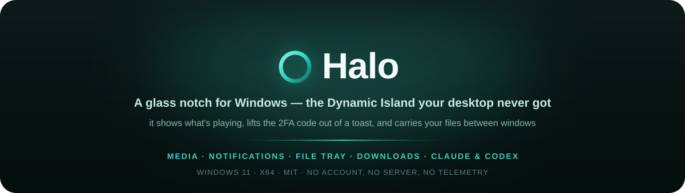
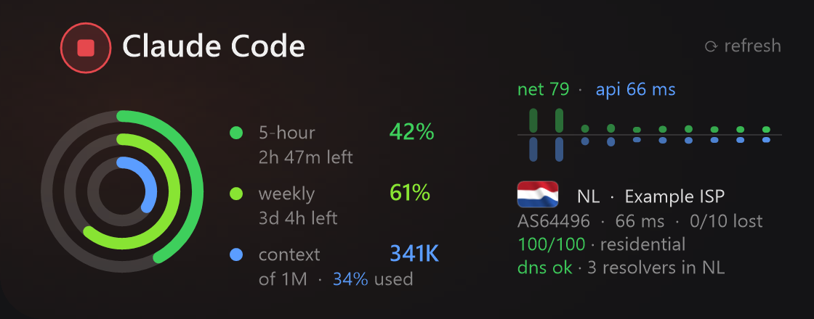

**A glass notch for Windows — the Dynamic Island your desktop never got.**

 

 

**English** · [فارسی](README.fa.md)

[⬇️ Download](https://github.com/phoseinq/Halo/releases/latest) · [Report a bug](https://github.com/phoseinq/Halo/issues) · [Request a feature](https://github.com/phoseinq/Halo/issues)

 

  

### 👉 [Try the pill in your browser](https://pvboy.dev/assets/blog/halo-live.html)

No install. Hover it, open the panel, drag the seek bar, tap the circle to swap app.

 

A pill of glass at the top of your screen. It comes forward when there is something to say and
folds away when there is not. No app to open, nothing covering your work.

 

<h2 align="center">⬇️ Install</h2>

### [⬇️ Download for Windows](https://github.com/phoseinq/Halo/releases/latest)

Windows 11 · x64 · per-user, no admin prompt

Take `DynamicWinSetup.exe` to install it, or `DynamicWinPortable.zip` to just run it.

 

<h2 align="center">🎵 Media</h2>

Collapsed, a waveform off the real system output. Open, the whole player — art, track, seek,
volume, transport, plus ±10s, speed and subtitles for video. It reads Windows' own media session,
so it works with whatever is already playing.

 

<h2 align="center">🔔 Notifications</h2>

Every toast lands in the pill with the real app icon, and the native banner goes quiet so nothing
is said twice. If it carries a **verification code**, the pill lifts it onto a button — one click
to copy.

 

<h2 align="center">📁 File tray</h2>

Drop files onto the pill and it holds them. Drag them back out into any window later — a different
app, a different desktop, twenty minutes on.

 

<h2 align="center">🤖 Coding sessions</h2>

A live panel per **Claude Code** and **Codex** session: what it is doing, context left, your 5-hour
and weekly limits, and a Cancel that stops the running prompt. The graph tracks both your internet
and the path to Anthropic, so when things stall you can see whose side it is. Point at the exit and
it turns into an audit: country, ASN, latency and loss, and a real DNS leak test. Any tool can join
by writing a small JSON file.

 

<h2 align="center">…and the quiet ones</h2>

- ⬇️ **Downloads** — real progress in Chrome and Edge, and a Cancel that actually cancels.
- 🔋 **Bluetooth battery** — connect headphones, a controller or your phone and the pill shows the level.
- ⚠️ **Alerts** — battery, CPU, RAM and internet, each fired once when it happens rather than nagged.
- 📌 **Pin** — keep it above fullscreen apps. Hold the pushpin to make it visible in screen recordings too.

 

> [!NOTE]
> Halo is a from-scratch rewrite of [DynamicWin](https://github.com/FlorianButz/DynamicWin) by Florian Butz — no upstream code. Built with .NET 9.

 

---

⭐ **If you install it and end up liking the little assistant, support the project with a star.**

MIT License · made by <a href="https://github.com/phoseinq">phoseinq</a> · <a href="https://pvboy.dev">pvboy.dev</a>

